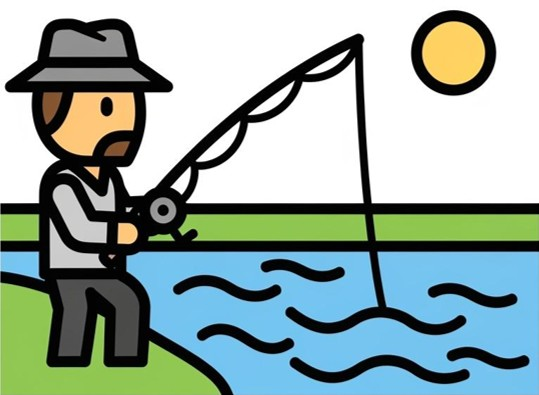
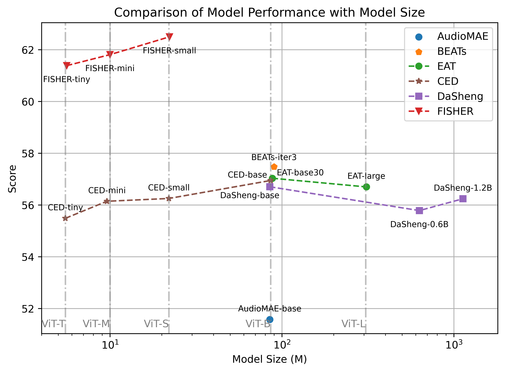
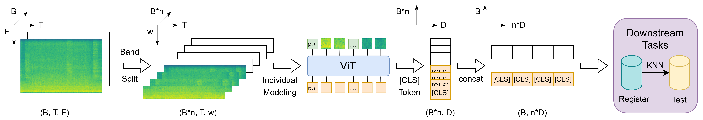

<h1 align="center">
  
  <span style="margin-left: 10px">FISHER</span>
</h1>

<div align="center">
  <a href="https://www.python.org/">
    
  </a>
  <a href="https://pytorch.org/">
    
  </a>
  <a href="https://arxiv.org/abs/2507.16696">
    
  </a>
  <a href="https://huggingface.co/collections/jiangab/fisher-688311579256529052be91a2">
    
  </a>
</div>

<br>

<div align="center">
    
</div>

## 🔥🔥🔥 Updates

- [2025.7.25] FISHER is now integrated on HuggingFace🤗.

- [2025.7.23] We release the inference code and checkpoints for tiny, mini and small.

## Introduction

<div align="center">
    
</div>

FISHER is a **F**oundation model for **I**ndustrial **S**ignal compre**HE**nsive **R**epresentation, which models heterogeneous industrial signals (sound, vibration, voltage, etc.) in a unified manner. FISHER accepts arbitrary sampling rates and models the increment of sampling rate as the concatenation of sub-band information, which first splits a STFT spectrogram into sub-bands before processsing it by the ViT encoder. FISHER is trained by teacher student EMA self-distillation.

To evaluate the model, we develop the RMIS benchmark, which will also be open-sourced in the near future. FISHER achieves the SOTA performances on the RMIS benchmark with much more efficient scaling properties.

## Checkpoints

We release the checkpoints of FISHER-tiny, FISHER-mini and FISHER-small.

| Version| 📦 Google Drive | ☁️ Tsinghua Cloud | 🤗 HuggingFace |
|------------| :------------: | :--------: | :--------: |
| FISHER-tiny | [Link](https://drive.google.com/file/d/1-_VQlp-LskhdaWk-n8LXVsmhcyalk6oU/view?usp=drive_link) | [Link](https://cloud.tsinghua.edu.cn/f/630a4b1b2962481a9150/?dl=1) | [Link](https://huggingface.co/jiangab/FISHER-tiny-0723) |
| FISHER-mini | [Link](https://drive.google.com/file/d/1fsEs70Eu1LtF2NpR6sG-wDbyAuYeTyZv/view?usp=drive_link) | [Link](https://cloud.tsinghua.edu.cn/f/60b3bfc0977f45f48dff/?dl=1) | [Link](https://huggingface.co/jiangab/FISHER-mini-0723) |
| FISHER-small | [Link](https://drive.google.com/file/d/1vPeAnz-q8NpI7OwxDulbFPE5ftVzfqxS/view?usp=drive_link) | [Link](https://cloud.tsinghua.edu.cn/f/f997a6932b614046915e/?dl=1) | [Link](https://huggingface.co/jiangab/FISHER-small-0723) |

## Inference

Please use the following code to infer the signal representation by FISHER.

```python
import torch
import torchaudio
import torch.nn.functional as F
from models.fisher import FISHER

wav, sr = torchaudio.load('/path/to/local/signal.wav')
# You can replace it with your custom loading function for other signals

wav = wav - wav.mean()
STFT = torchaudio.transforms.Spectrogram(
    n_fft=25 * sr // 1000,
    win_length=None,
    hop_length=10 * sr // 1000,
    power=1,
    center=False
)
spec = torch.log(torch.abs(STFT(wav)) + 1e-10)
spec = spec.transpose(-2, -1)  # [1, time, freq]
spec = (spec + 3.017344307886898) / (2.1531635155379805 * 2)

model_path = '/path/to/local/fisher/model.pt'  # Please download the checkpoint in advance.
model = FISHER.from_pretrained(model_path)
model = model.cuda()
model.eval()

# time-wise cutoff
if spec.shape[-2] > 1024:
    spec = spec[:, :1024]
# freq-wise padding
if spec.shape[-1] < model.cfg.band_width:
    spec = F.pad(spec, (0, model.cfg.band_width - spec.shape[-1]))
spec = spec.unsqueeze(1).cuda()

with torch.no_grad():
    # Use autocast for mixed precision inference. You can disable it for full precision.
    with torch.autocast('cuda'):
        repre = model.extract_features(spec)
print(repre.shape)
```

## Acknowledgements

FISHER is developed based on [EAT](https://github.com/cwx-worst-one/EAT) and [fairseq](https://github.com/facebookresearch/fairseq). We thank these authors for open-sourcing their works.

## Citation

If you find FISHER useful, please cite the following paper.

```bibtex
@article{fan2025fisher,
  title={FISHER: A Foundation Model for Multi-Modal Industrial Signal Comprehensive Representation},
  author={Fan, Pingyi and Jiang, Anbai and Zhang, Shuwei and Lv, Zhiqiang and Han, Bing and Zheng, Xinhu and Liang, Wenrui and Li, Junjie and Zhang, Wei-Qiang and Qian, Yanmin and Chen, Xie and Lu, Cheng and Liu, Jia},
  journal={arXiv preprint arXiv:2507.16696},
  year={2025}
}
```
